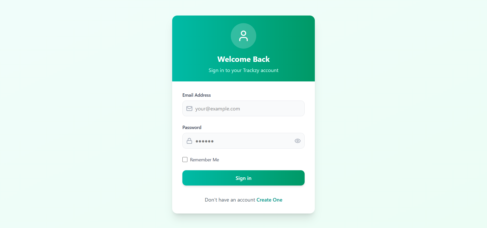
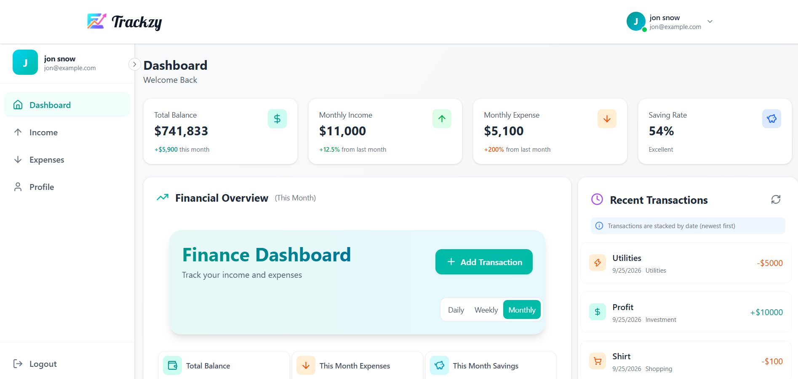

# Trackzy

A smart expense tracker to manage income and expenses in one place.

## 🚀 Live Demo

[Trackzy Live Demo](https://smart-expense-tracker-web.onrender.com/)

## ✨ Features

- User registration and login with JWT authentication
- Protected routes for secure user access
- Add and view income and expense transactions
- Category-based transaction management
- Responsive dashboard with total balance, income, expenses, savings, and recent transactions
- Monthly financial overview
- Export income records to Excel
- User-specific transaction data

## 📸 Screenshots

### 🔐 Login



### 📊 Dashboard



## 🛠️ Technologies Used

- **Frontend:** React
- **Backend:** Node.js, Express.js
- **Database:** MongoDB
- **Authentication:** JWT
- **API:** REST API
- **Other:** JavaScript, HTML, CSS

## 📂 Getting Started

### 1. Clone the repository

```bash
git clone https://github.com/kushal214/Trackzy.git
cd Trackzy
```

### 2. Setup the Backend

```bash
cd backend
npm install
```

Create a `.env` file inside the `backend` folder:

```env
MONGO_URI=your_mongodb_connection_string
JWT_SECRET=your_jwt_secret
PORT=4000
```

Start the backend:

```bash
npm start
```

The backend will run on:

```text
http://localhost:4000
```

### 3. Setup the Frontend

Open a new terminal:

```bash
cd frontend
npm install
npm run dev
```

The frontend will run on the local Vite development server shown in your terminal.

## 📖 How to Use

1. Create a new account using the registration page.
2. Log in with your email and password.
3. Use the dashboard to view your financial summary.
4. Add income and expense transactions.
5. View recent transactions and monthly financial information.
6. Export your income records to Excel when required.

## 📁 Project Structure

```text
Trackzy/
├── backend/
│   ├── config/
│   ├── controllers/
│   ├── middleware/
│   ├── models/
│   ├── routes/
│   ├── utils/
│   ├── server.js
│   ├── package.json
│   └── package-lock.json
│
├── frontend/
│   ├── public/
│   ├── src/
│   │   ├── assets/
│   │   ├── components/
│   │   ├── pages/
│   │   ├── utils/
│   │   ├── App.jsx
│   │   ├── index.css
│   │   └── main.jsx
│   ├── index.html
│   ├── vite.config.js
│   ├── package.json
│   └── package-lock.json
│
├── screenshots/
│   ├── login.png
│   └── dashboard.png
│
├── .gitignore
├── README.md
└── package.json
```

## 👨‍💻 Author

**Kushal Pan**

- GitHub: [kushal214](https://github.com/kushal214)

---

⭐ If you like this project, consider giving it a star on GitHub!